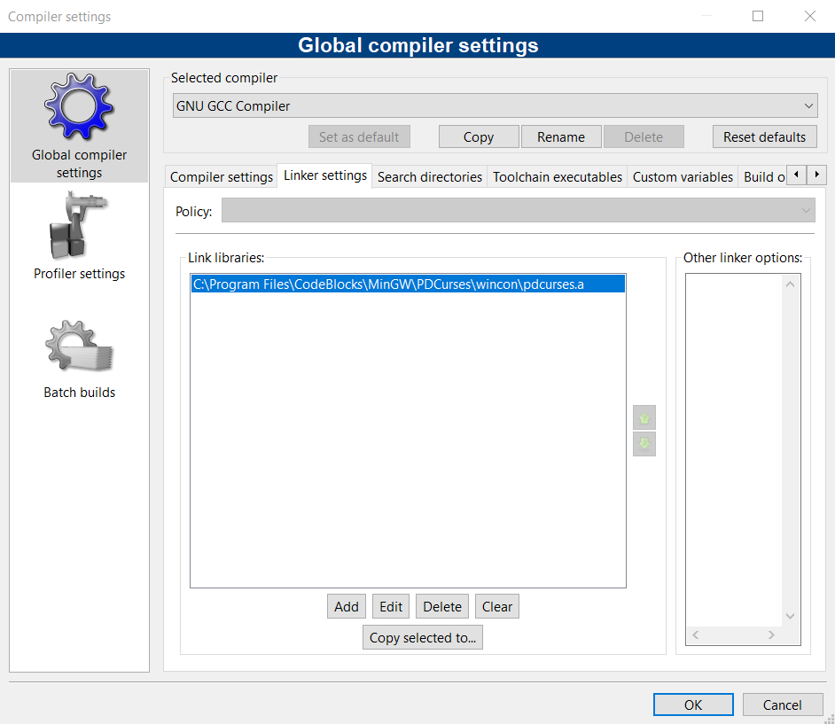
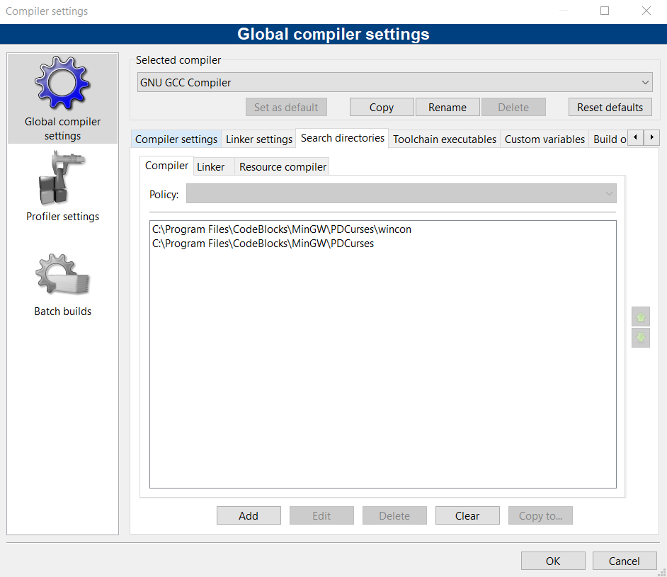

# Hangman (Jeu du pendu)

## Descritpion du projet
L'objectif du projet est de créer le jeu du pendu en C++ en __programmation orientée objet__ ainsi qu'une interface graphique __GUI__ permettant de visualiser le jeu. Etant sous Windows, j'ai décidé d'utiliser la librairie __PDCurses__ en utilisant l'éditeur __Code::Blocks__

_____________________________________________________

## Contenu du repository
`main.cpp` : code principal  
`hangman.h` : définition de la classe _Hangman_  
`hangman.cpp` : déclaration des méthodes de la classe _Hangman_  

## Instructions pour la compilation
⇨ __Il faut au préalable télécharger la librairie PDCurses sur sa machine__

* Compilation sous Code::Blocks :  
1) Déplacer la librairie PDCurses à l'emplacement : 
_C:\Program Files\CodeBlocks\MinGW\PDCurses_
2) Lier la librairie au compilateur de Code::Blocks :  
  \, 

* Compilation usuelle  
Il faut appeler la librairie PDCurses ou NCURSES selon votre distribution et la librairie que vous avez installée.  

## Comment jouer ?
- Exécuter le programme
- Appuyer sur ENTRÉE pour commencer le jeu
- Taper les lettres du mot à faire deviner une par une, les unes à la suite des autres
- Appuyer sur __";"__ pour cacher le mot et commencer le jeu du pendu
- Deviner le mot caché en tapant successivement les lettres auquelles vous pensez 
- Fin de partie : Appuyer sur ENTRÉE pour quitter

_____________________________________________________

# Commentaires

## Évolution du projet
Objectifs principaux :  
-> Se familiariser avec PDCurses
-> Coder le jeu du pendu pour un mot caché fixé (juste affichage des lettres)
-> Coder la GUI (dessin du bonhomme et nombre de vie)

Puis rajout de règles et de fonctionnalités :
-> Rajout de l'affichage des lettres demandées
-> Affichage d'une erreur si le joueur demande une lettre déjà demandée
-> Demander un mot à faire deviner à l'utilisateur

## Sources
* [NCURSES](https://tldp.org/HOWTO/NCURSES-Programming-HOWTO/)
* [CppReference std::vector](https://en.cppreference.com/w/cpp/container/vector)
* [CppReference std::find](https://en.cppreference.com/w/cpp/algorithm/find)
